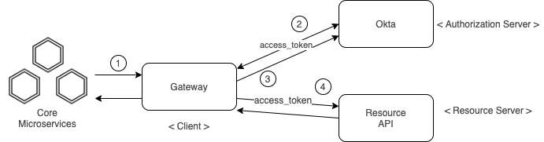

# Gateway oauth2

Gateway implementado con Spring Cloud Gateway y Spring Security basado en oauth2. 

__Authorization Grant__ implementados:

* [Resource Owner Password Credentials](https://tools.ietf.org/html/rfc6749#section-1.3.3)
* [Client Credentials](https://tools.ietf.org/html/rfc6749#section-1.3.4)  




1. Request resource (sin access-token)
2. Request access-token
3. Response access-token
4. Request resource (con access-token)

## Gateway
Implementacion de gateway basada en Spring Cloud Gateway. Es responsable de brindar un unico punto de acceso a los recursos desplegados en una red de externa/interna (outbound/inbound). Gestiona todo lo relacionado con seguridad, enrutamiento, reintentos, caching, etc.

Los predicados usados para matchear las rutas definidas, asi como los filtros a aplicar a los request/response pueden encontrarse [aqui](gateway/src/main/resources/application.yml)

Existe un [global filter](https://cloud.spring.io/spring-cloud-static/spring-cloud-gateway/2.2.2.RELEASE/reference/html/#global-filters) responsable de enrutar las rutas bajo los schemas http/https usando webclient

```java
    @Bean 
	public WebClientHttpRoutingFilter webClientHttpRoutingFilter(WebClient webClient, ObjectProvider<List<HttpHeadersFilter>> headersFilters) { 
		return new WebClientHttpRoutingFilter(webClient, headersFilters);
	}
```

## Security
Manejada por Spring Security e integrada con oauth2 usando [Resource Owner Password Credentials](https://tools.ietf.org/html/rfc6749#section-1.3.3) y [Client Credentials](https://tools.ietf.org/html/rfc6749#section-1.3.4)


### Authorization Server
Componente encargado de generar *access/refresh tokens* para poder acceder a los recursos protegidos sobre el [Resource Server](#resource-server)

En esta demo el auth server se implemento sobre [Okta](https://www.okta.com/). Hay algunas [guias](https://developer.okta.com/docs/guides/) muy interesantes acerca de como desplegar y configurar un auth server sobre Okta


Los detalles del provider oauth2 configurado se puede encontrar [aqui](gateway/src/main/resources/application.yml)


### Client
Componente encargado de consumir los recursos servidos por el [Resource Server](#resource-server) en nombre del *Resource Owner*

Esta implementacion esta basada en *Reactive* para poder integrarse con *Spring Cloud Gateway* (ver [SecurityConfig](gateway/src/main/java/com/demo/gateway/config/SecurityConfig.java))

El webclient utilizado por el WebClientHttpRoutingFilter esta configurado con oauth2 a traves de un ExchangeFilterFunction. 

```java
    @Bean
    WebClient webClient(ReactiveOAuth2AuthorizedClientManager authorizedClientManager) {
        ServerOAuth2AuthorizedClientExchangeFilterFunction oauth =
                new ServerOAuth2AuthorizedClientExchangeFilterFunction(authorizedClientManager);
        oauth.setDefaultOAuth2AuthorizedClient(true);
        oauth.setDefaultClientRegistrationId(client-registration-id);
        return WebClient.builder()
                .filter(oauth)
                .build();
    }
```

De esta manera cada peticion que necesite ser enrutada por el WebClientHttpRoutingFilter se hara a traves de este webclient, y el mismo gestionara los tokens de acceso a traves de un ReactiveOAuth2AuthorizedClientManager 

```java
    @Bean
    public ReactiveOAuth2AuthorizedClientManager authorizedClientManager(
            ReactiveClientRegistrationRepository clientRegistrationRepository,
            ServerOAuth2AuthorizedClientRepository authorizedClientRepository) {

        ReactiveOAuth2AuthorizedClientProvider authorizedClientProvider =
                ReactiveOAuth2AuthorizedClientProviderBuilder.builder()
                        //.refreshToken()
                		.password()
                        .clientCredentials()
                        .build();
        
        DefaultReactiveOAuth2AuthorizedClientManager authorizedClientManager =
                new DefaultReactiveOAuth2AuthorizedClientManager(
                        clientRegistrationRepository, authorizedClientRepository);
        authorizedClientManager.setAuthorizedClientProvider(authorizedClientProvider);

        // For the `password` grant, the `username` and `password` are supplied via request parameters,
        // so map it to `OAuth2AuthorizationContext.getAttributes()`.
        authorizedClientManager.setContextAttributesMapper(contextAttributesMapper());

        return authorizedClientManager;
    }
```

Los detalles de la configuracion de los clientes oauth2 se encuentra [aqui](gateway/src/main/resources/application.yml)

### Resource Server
Componente encargado de servir los recursos protegidos y desplegado en http://resource:9000

La configuracion para validar la validez de los *access tokens* puede encontrarse [aqui](resource/src/main/resources/application.yml)

Para acceder al endpoint /resource el cliente debera presentar un JWT con el scope 'openid' o 'my_scope' (ver [SecurityConfig](resource/src/main/java/com/demo/resource/config/SecurityConfig.java))


## Pruebas
Hay un [set de pruebas](gw-password-grant.postman_collection.json) que puede utilizarse para:

1. Probar el acceso a los recursos protegidos en http://resource:9000/resource a traves del gateway
2. Probar el acceso a los recursos protegidos en http://resource:9000/resource sin pasar por el gateway

## Run
Para levantar el resource server y el gateway (client) ejecutar `docker-compose up -d`

## Pre-requisitos
Un authorization server y dos aplicaciones clientes registradas (una basada en client credentials y otra en password grant)

## Configuracion
Por medio de la config `client-registration-id` es posible configurar cual cliente utilizar para la autorizacion


## Referencias
* [Spring Cloud Gateway](https://spring.io/projects/spring-cloud-gateway)
* [Spring Security](https://docs.spring.io/spring-security/site/docs/current/reference/html5/)